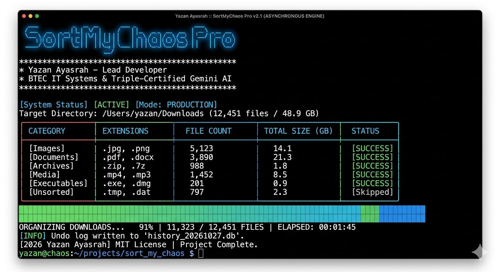

# SortMyChaos Pro

<div align="center">
  
  
  [](https://www.python.org/downloads/)
  [](https://opensource.org/licenses/MIT)
  [](https://github.com/yourusername/SortMyChaos/actions)
  
  *A high-performance, asynchronous file management engine that organizes your chaotic directories with lightning speed and professional-grade features.*
</div>

---

## 📋 Table of Contents

- [✨ Features](#-features)
- [🚀 Quick Start](#-quick-start)
- [📸 Screenshots](#-screenshots)
- [🔧 Installation](#-installation)
- [📖 Usage](#-usage)
- [⚙️ Configuration](#️-configuration)
- [🔄 Undo Functionality](#-undo-functionality)
- [📝 Logging](#-logging)
- [🤝 Contributing](#-contributing)
- [📄 License](#-license)
- [👨‍💻 Developer](#-developer)

---

## ✨ Features

<div align="center">

| Feature | Description |
|---------|-------------|
| 🚀 **Asynchronous Engine** | Utilizes `asyncio` and `pathlib` for blazing-fast file operations, handling thousands of files efficiently without blocking |
| 🔄 **Undo Functionality** | Maintains a local SQLite database to track all moves, allowing you to seamlessly undo the last organization session |
| ⚙️ **Customizable Configuration** | Uses a `config.yaml` file for defining file categories and extensions. Automatically creates a default config if none exists |
| 🎨 **Modern Terminal UI** | Features a professional dashboard built with the Rich library, including real-time progress indicators, summary tables, and status panels |
| 📝 **Comprehensive Logging** | Logs all activities and errors to `sort_log.txt` for debugging and auditing purposes |
| 🌍 **Cross-Platform** | Works seamlessly on Windows, macOS, and Linux |

</div>

---

## 🚀 Quick Start

```bash
# Clone and setup
git clone https://github.com/yourusername/SortMyChaos.git
cd SortMyChaos
pip install -r requirements.txt

# Organize your downloads folder
python main.py ~/Downloads

# Oops? Undo it!
python main.py --undo
```

---

## 📸 Screenshots

### Terminal Interface
```
┌─ System Status ──────────────────────────────────────┐
│ Starting organization...                              │
└───────────────────────────────────────────────────────┘

Organizing files... ⠦

┌─ File Organization Summary ──────────────────────────┐
│ Category    Count    Total Size (MB)                 │
├──────────────────────────────────────────────────────┤
│ Images      15       245.67                          │
│ Documents   8        12.34                           │
│ Videos      3        1024.56                          │
│ Others      2        5.78                             │
└───────────────────────────────────────────────────────┘

┌─ System Status ──────────────────────────────────────┐
│ Organization complete!                               │
└───────────────────────────────────────────────────────┘
```

---

## 🔧 Installation

### 📋 Prerequisites
- **Python**: 3.9 or higher
- **pip**: Python package manager
- **Operating System**: Windows, macOS, or Linux

### 🛠️ Steps

1. **Clone the repository**:
   ```bash
   git clone https://github.com/yourusername/SortMyChaos.git
   cd SortMyChaos
   ```

2. **Create virtual environment** (recommended):
   ```bash
   python -m venv venv
   source venv/bin/activate  # On Windows: venv\Scripts\activate
   ```

3. **Install dependencies**:
   ```bash
   pip install -r requirements.txt
   ```

4. **Verify installation**:
   ```bash
   python main.py --help
   ```

---

## 📖 Usage

### Organize a Directory
```bash
python main.py /path/to/your/directory
```

**What happens:**
- 🔍 Scans the specified directory for files
- 📂 Moves files into categorized subfolders based on extensions
- 📊 Displays a live progress indicator
- 📈 Shows a summary table with file counts and sizes

### Undo the Last Organization
```bash
python main.py --undo
```

**Features:**
- 🔙 Reverses all moves from the most recent organization session
- 🛡️ Safe operation that restores original file locations
- 🗃️ Automatically cleans up the database after undo

### Command Line Options
```
usage: main.py [-h] [--undo] [directory]

SortMyChaos Pro - File Organizer

positional arguments:
  directory   Directory to organize (not needed for --undo)

options:
  -h, --help  Show this help message and exit
  --undo      Undo last organization session
```

---

## ⚙️ Configuration

SortMyChaos Pro uses a `config.yaml` file to define file categories and their associated extensions. If the file doesn't exist, a default configuration is automatically created.

### 📄 Default Configuration
```yaml
categories:
  Images:
    - .jpg
    - .jpeg
    - .png
    - .gif
    - .bmp
    - .tiff
    - .svg
  Videos:
    - .mp4
    - .avi
    - .mkv
    - .mov
    - .wmv
  Documents:
    - .pdf
    - .doc
    - .docx
    - .txt
    - .rtf
    - .odt
  Audio:
    - .mp3
    - .wav
    - .flac
    - .aac
    - .ogg
  Archives:
    - .zip
    - .rar
    - .7z
    - .tar
    - .gz
  Code:
    - .py
    - .js
    - .html
    - .css
    - .java
    - .cpp
    - .c
  Others: []  # Files not matching any category
```

### 🔧 Customizing Categories

1. **Edit the config file**:
   ```bash
   nano config.yaml  # or your preferred editor
   ```

2. **Add new categories**:
   ```yaml
   categories:
     # ... existing categories ...
     Spreadsheets:
       - .xlsx
       - .xls
       - .csv
     Presentations:
       - .pptx
       - .ppt
   ```

3. **Restart the application** to apply changes

> **💡 Tip**: Extensions are case-insensitive. Files without matching extensions go to the "Others" folder.

---

## 🔄 Undo Functionality

The undo feature uses a SQLite database (`history.db`) to track all file moves. Each organization session creates a new entry, allowing precise reversal.

### 🔍 How It Works
- **Session Tracking**: Every organization run creates a unique session ID
- **Move Logging**: Each file move is recorded with source and destination paths
- **Database Storage**: All operations are stored in a local SQLite database

### ✨ Key Features
- 🔄 **Automatic Tracking**: Every move is logged automatically
- 🎯 **Session-Based**: Undo affects only the last complete organization session
- 🛡️ **Safe Reversal**: Moves files back to their original locations
- 🧹 **Database Cleanup**: Undone sessions are removed from the database

---

## 📝 Logging

All operations are logged to `sort_log.txt` with timestamps for debugging and auditing.

### 📄 Sample Log Output
```
2026-03-27 10:30:15 - INFO - Moved /path/to/file.jpg to /path/to/Images/file.jpg
2026-03-27 10:30:16 - INFO - Moved /path/to/document.pdf to /path/to/Documents/document.pdf
2026-03-27 10:30:17 - ERROR - Failed to move /path/to/locked_file.txt: Permission denied
2026-03-27 10:30:18 - WARNING - File /path/to/duplicate.jpg already exists in destination
```

### 📊 Log Levels
- **INFO**: Successful operations and general information
- **ERROR**: Failed operations with error details
- **WARNING**: Non-critical issues that don't stop execution

---

## 🤝 Contributing

We welcome contributions! Here's how you can help:

### 🚀 Getting Started
1. **Fork** the repository
2. **Clone** your fork: `git clone https://github.com/yourusername/SortMyChaos.git`
3. **Create** a feature branch: `git checkout -b feature/amazing-feature`
4. **Make** your changes
5. **Test** thoroughly
6. **Commit** your changes: `git commit -m 'Add amazing feature'`
7. **Push** to the branch: `git push origin feature/amazing-feature`
8. **Open** a Pull Request

### 🛠️ Development Setup
```bash
git clone https://github.com/yourusername/SortMyChaos.git
cd SortMyChaos
python -m venv venv
source venv/bin/activate  # On Windows: venv\Scripts\activate
pip install -r requirements.txt
pip install flake8 pytest  # For linting and testing
```

### 📏 Code Style
- Follow **PEP 8** guidelines
- Use **type hints** where appropriate
- Ensure code passes **flake8** linting
- Write **tests** for new features
- Keep commit messages clear and descriptive

### 🐛 Found a Bug?
- Check existing [issues](../../issues) first
- Open a new issue with detailed description
- Include steps to reproduce and system information

---

## 📄 License

This project is licensed under the **MIT License** - see the [LICENSE](LICENSE) file for details.

---

## 👨‍💻 Developer

<div align="center">

**Yazan Ayasrah**  
*Senior DevOps & Python Engineer*  

Specializing in Pearson BTEC IT Systems with Triple-Certified Gemini AI Specialist status.

[](https://linkedin.com/in/yazanayasrah)
[](https://github.com/yazanayasrah)

</div>

---

<div align="center">

**Built with ❤️ using Python, asyncio, and Rich**

*Organize your chaos, one file at a time!*

</div>